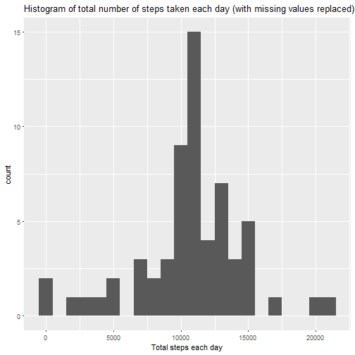
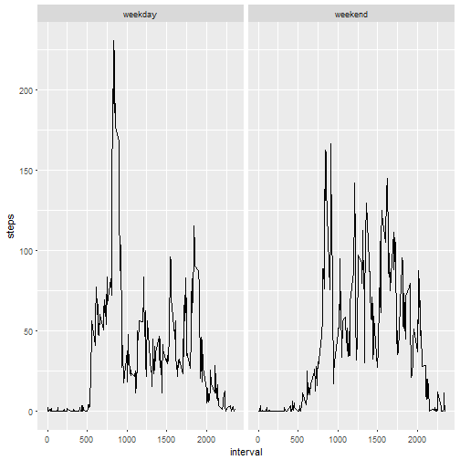

##Loading and preprocessing the data 

1. Load the data

```r
data <- read.csv("activity.csv")
```
2. Process the data into a suitable format

```r
library(lubridate)
data$date <- ymd(data$date)
```


##What is the mean number of steps taken per day?

Total number of steps taken per day

```r
Tsteps <- aggregate(data$steps, by = list(Date = data$date), FUN = sum)
names(Tsteps) <- c("Date", "Total")
Tsteps
```

```
##          Date Total
## 1  2012-10-01    NA
## 2  2012-10-02   126
## 3  2012-10-03 11352
## 4  2012-10-04 12116
## 5  2012-10-05 13294
## 6  2012-10-06 15420
## 7  2012-10-07 11015
## 8  2012-10-08    NA
## 9  2012-10-09 12811
## 10 2012-10-10  9900
## 11 2012-10-11 10304
## 12 2012-10-12 17382
## 13 2012-10-13 12426
## 14 2012-10-14 15098
## 15 2012-10-15 10139
## 16 2012-10-16 15084
## 17 2012-10-17 13452
## 18 2012-10-18 10056
## 19 2012-10-19 11829
## 20 2012-10-20 10395
## 21 2012-10-21  8821
## 22 2012-10-22 13460
## 23 2012-10-23  8918
## 24 2012-10-24  8355
## 25 2012-10-25  2492
## 26 2012-10-26  6778
## 27 2012-10-27 10119
## 28 2012-10-28 11458
## 29 2012-10-29  5018
## 30 2012-10-30  9819
## 31 2012-10-31 15414
## 32 2012-11-01    NA
## 33 2012-11-02 10600
## 34 2012-11-03 10571
## 35 2012-11-04    NA
## 36 2012-11-05 10439
## 37 2012-11-06  8334
## 38 2012-11-07 12883
## 39 2012-11-08  3219
## 40 2012-11-09    NA
## 41 2012-11-10    NA
## 42 2012-11-11 12608
## 43 2012-11-12 10765
## 44 2012-11-13  7336
## 45 2012-11-14    NA
## 46 2012-11-15    41
## 47 2012-11-16  5441
## 48 2012-11-17 14339
## 49 2012-11-18 15110
## 50 2012-11-19  8841
## 51 2012-11-20  4472
## 52 2012-11-21 12787
## 53 2012-11-22 20427
## 54 2012-11-23 21194
## 55 2012-11-24 14478
## 56 2012-11-25 11834
## 57 2012-11-26 11162
## 58 2012-11-27 13646
## 59 2012-11-28 10183
## 60 2012-11-29  7047
## 61 2012-11-30    NA
```

Histogram of total number of steps taken each day

```r
library(ggplot2)
hist <- ggplot(data=Tsteps, aes(Total)) +  geom_histogram(binwidth=1000) + xlab("Total steps each day")+ ggtitle ("Histogram of total number of steps taken each day")
hist 
```

```
## Warning: Removed 8 rows containing non-finite values (stat_bin).
```


Mean and median number of steps taken each day

```r
mean(Tsteps$Total, na.rm=T)
```

```
## [1] 10766.19
```

```r
median(Tsteps$Total, na.rm=T)
```

```
## [1] 10765
```


##What is the average daily activity pattern?

Time series plot of the average number of steps taken

```r
minterval <- aggregate(data$steps, by=list(interval = data$interval), FUN = mean, na.rm=T)
names(minterval) <- c("interval", "mean.steps")

ggplot(data = minterval,aes(x=interval,y=mean.steps)) + geom_line() + ggtitle("Time series of mean steps taken per 5 minute interval")
```


5 minute interval that, on average, contains the maximum number of steps 

```r
minterval[which.max(minterval$mean.steps),]
```

```
##     interval mean.steps
## 104      835   206.1698
```


##Imputing missing values

Total number of missing values in the dataset

```r
sum(is.na(data$steps))
```

```
## [1] 2304
```

Filling in the missing values in the data set and creating an new data set with missing values filled in 

```r
newdata <- data
mean <- tapply(newdata$steps, newdata$interval,mean,na.rm=T)
newdata$steps[is.na(newdata$steps)]  <- mean[as.character(newdata$interval[is.na(newdata$steps)])]

head(newdata)
```

```
##       steps       date interval
## 1 1.7169811 2012-10-01        0
## 2 0.3396226 2012-10-01        5
## 3 0.1320755 2012-10-01       10
## 4 0.1509434 2012-10-01       15
## 5 0.0754717 2012-10-01       20
## 6 2.0943396 2012-10-01       25
```

```r
sum(is.na(newdata))
```

```
## [1] 0
```


Histogram of total number of steps taken each day after missing values are imputed

```r
Tsteps2 <- aggregate(newdata$steps, by = list(Date = newdata$date), FUN = sum)
names(Tsteps2) <- c("Date", "Total")
library(ggplot2)
hist <- ggplot(data=Tsteps2, aes(Total)) +  geom_histogram(binwidth=1000) + xlab("Total steps each day")+ ggtitle ("Histogram of total number of steps taken each day (with missing values replaced)")
hist 
```



Mean and median total number of steps taken per day 

```r
mean(Tsteps2$Total)
```

```
## [1] 10766.19
```

```r
median(Tsteps2$Total)
```

```
## [1] 10766.19
```

Difference between these values and originals 

```r
mean(Tsteps2$Total)
```

```
## [1] 10766.19
```

```r
median(Tsteps2$Total)
```

```
## [1] 10766.19
```

```r
mean(Tsteps$Total, na.rm=T)
```

```
## [1] 10766.19
```

```r
median(Tsteps$Total, na.rm=T)
```

```
## [1] 10765
```

Impact of imputing missing data
- The impact is that now, with the new data, the mean and medians are the same 


##Differences in activity patterns between weekday and weekends? 

Create a new factor variasble in the dataset with 2 levels - "weekday" and "weekend"

```r
library(dplyr)
newdata <- mutate(newdata, day = 
    ifelse(weekdays(newdata$date)=="Saturday"| weekdays(newdata$date)=="Sunday","weekend", "weekday")) 
```

Time series comparing weekends to weekdays

```r
newint <- newdata %>%
    group_by(interval,day) %>%
    summarise(steps=mean(steps))

plot <- ggplot(newint,aes(interval,steps)) + geom_line() + facet_wrap(~day)
plot
```



This shows more activity during weekdays than weekends   

END
